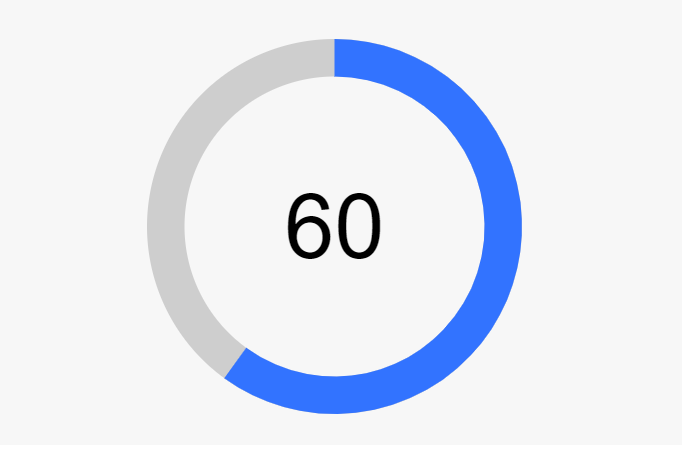

# Circel progressBar

[Демо страница](https://sulky-cat.github.io/Progressbar-circle/demo/)



## Содержание
- [html](#html)
- [js](#js)
- [Параметры](#параметры)
- [Методы](#методы)
- [Примеры скриптов](#примеры-скриптов)
- [css](#css)
- [Примеры стилизации](#примеры-стилизации)


## HTML
```html
<div class="progress-bar"></div>
``` 
Атрибуты: 
* `data-min` - минимальное значение. По умолчанию `0`;
* `data-max` - максимальное значение. По умолчанию `100`;
* `data-current` - текущее значение. По умолчанию `60`;
* `data-clockwise` - направление. `true` - по часовой, `false` - против часовой. По умолчанию `true`;
* `data-angle` - угол начала отсчета. По умолчанию `-90`;
* `data-duration` - время проигрывания анимации. По умолчанию `2000` (ms).

## JS
Инициализация:
```js
// Элемент, куда будет выводиться svg
const renderElement = document.querySelector('.progress-bar')
// Указаны значения по умолчанию
const optionsObj = {
   min: 0,
   max: 100,
   current: 60,
   clockwise: true,
   angle: -90,
   animation: {
      duration: 2000,
      trigger: false,
      cb: (current) => { },
      timeFunc: (time, current, duration, min) => {
         current -= min
         time /= duration
         return current * time * time + min
      },
   },
   text: {
      formatText: (current) => `${current}`
   },
}
// Инициализация (создание экземпляра)
const progressBar = new ProgressBar(renderElement, optionsObj)
``` 
* `renderElement` - элемент, внутри которого будет выводиться прогресс-бар.
* `optionsObj` - объект опций.

### Параметры
Все параметры и их значения по умолчанию можно посмотреть в статическом свойстве класса 
```js
ProgressBar.defaultOptions
```
* `min` - минимальное значение. По умолчанию `0`;
* `max` - максимальное значение. По умолчанию `100`;
* `current` - текущее значение. По умолчанию `60`;
* `clockwise` - направление. `true` - по часовой, `false` - против часовой. По умолчанию `true`;
* `angle` - угол начала отсчета. По умолчанию `-90`;
* `animation` - объект для настройки анимации. Для отключения анимации указать `false`;
* `animation.duration` - время проигрывания анимации. По умолчанию `2000` (ms);
* `animation.trigger` - срабатывание анимации по триггеру (вызов метода `animation()`). `true` - анимация будет срабатывать при ручном вызове метода, `false` - анимация проигрывается автоматически при загрузки страницы. По умолчанию `false`;
* `animation.cb(current)` - callback функция. Сработает после каждого шага (вызывается в методе `setProgress()`). В качестве аргумента принимает текущее значение прогресс-бара (в моменте заполнения, а не то, которое указывалось в инициализации); 
* `animation.timeFunc(time, current, duration, min)` - временная функция срабатывания анимации. Высчитывает каждый шаг заполнения. В качестве аргументов принимает время с начала выполнения анимации, текущее значение прогресс-бара, время выполнения анимации (которое указывается в `animation.duration` или соответствующем дата-атрибуте) и минимальное значение прогресс-бара (которое указывается в `animation.min` или соответствующем дата-атрибуте). Формулы для временных функций: [gizma.com](https://gizma.com);
* `text` - объект для настройки выводимого текста внутри тега `<text></text>`. Для отключения вывода текста указать `false`;
* `text.formatText(current)` - функция обработки выводимых значений. В качестве аргумента принимает текущее значение прогресс-бара (в моменте заполнения, а не то, которое указывалось в инициализации).


### Методы
1) `animation(objOpt)` - метод для воспроизведения анимации. При каждом шаге вызывает метод `setProgress()`. Принимает объект опций: 
   * `current` - значение, которое нужно установить;
   * `duration` - время выполнения анимации;
   * `cb()` - callback функция. Сработает после каждого шага (вызывается в методе `setProgress()`). В качестве аргумента принимает текущее значение прогресс-бара (в моменте заполнения, а не то, которое указывалось в инициализации); 
   * `timeFunc(time, current, duration, min)` - временная функция срабатывания анимации. Высчитывает каждый шаг заполнения. В качестве аргументов принимает время с начала выполнения анимации, текущее значение прогресс-бара, время выполнения анимации (которое указывается в `animation.duration` или соответствующем дата-атрибуте) и минимальное значение прогресс-бара (которое указывается в `animation.min` или соответствующем дата-атрибуте). Формулы для временных функций: [gizma.com](https://gizma.com).
Если не указать какой-нибудь из параметров, применится значение, которое было указано при инициализации.
Пример реализации см. в [7 пункте раздела "Примеры скриптов"](#7-использоавние-метода-animation).

2) `setProgress(current, cb)` - метод, который выставляет значение. Принимает параметры:
   * `current` - значение, которое нужно выставить;
   * `cb` - callback функцию, в которою передается текущее значение `current`.
Пример реализации см. в [8 пункте раздела "Примеры скриптов"](#8-использоавние-метода-setprogress).

4) `setText(current)` - метод для установки значения внутри тега `text`, применяя форматирование, которое было указано в свойстве `text.formatText`.

### Примеры скриптов
#### 1) Выключение анимации [пример](https://sulky-cat.github.io/Progressbar-circle/demo/#ex2) 
```js
new ProgressBar(element, {
   animation: false,
})
```
#### 2) Выключение цифр [пример](https://sulky-cat.github.io/Progressbar-circle/demo/#ex2) 
```js
new ProgressBar(element, {
   text: false,
})
```
#### 3) Настройка анимации [пример](https://sulky-cat.github.io/Progressbar-circle/demo/#ex5) 
```js
// Элемент, в котором будет выводиться текущее значениме
const anotherOutput  = document.querySelector('.another-output')
new ProgressBar(element, {
   animation: {
      duration: 3000,
      timeFunc: (time, current, duration, min) => {
         // easeInOutQuad https://gizma.com/easing/#easeInOutQuad
         time /= duration / 2;
         if (time < 1) return current / 2 * time * time + min;
         time--;
         return -current / 2 * (time * (time - 2) - 1) + min;
      },
      cb: (current) => {
         anotherOutput.children[0].innerHTML = current.toFixed(2)
      },
   }
})
```
#### 4) Анимация по триггеру [пример](https://sulky-cat.github.io/Progressbar-circle/demo/#ex6) 
```js
const btn = document.querySelector('.btn')
btn.onclick = () => ex_6.animation({})
const progressBar = new ProgressBar(element, {
   animation: { trigger: true }
})
```
#### 5) Форматирование текста [пример](https://sulky-cat.github.io/Progressbar-circle/demo/#ex9) 
```js
const progressBar = new ProgressBar(element, {
    text: {
      formatText: (cur) => `${cur}/${progressBar.max}`
   }
})
```
#### 6) Ожидание выполнения анимации [пример](https://sulky-cat.github.io/Progressbar-circle/demo/#ex10) 
Метод `animation()` возвращает `Promise`, что дает возможность дождаться выполнения анимации. Чтобы воспользоваться этим, необходимо вызвать метод `animation()` вручную, для чего нужно указать параметр `trigger` для `animation`.
```js
const progressBar = new ProgressBar(element, {
   animation: {
      trigger: true,
   }
})
const animationOptions = {
   current: 10,
   duration: 1000,
   cb: (cur)=> {console.log(cur)},
}
```
Далее ждем выполнения с помощью метода `then()` для `Promise`
```js
progressBar.animation(animationOptions)
.then(() => {
   alert('Анимация закончена')
})
```
Или с помощью `async await`
```js
async function wait() {
   await ex_10.animation(animationOptions)
   alert('Анимация закончена')
}
wait()
```
#### 7) Использоавние метода `animation()`
```js
const progressBar = new ProgressBar(element, {
   min: 10,
   max: 50,
   animation: {trigger: false},
})
progressBar.animation({
   current: 23,
   duration: 1000,
   cb: (current) => console.log(current),
   timeFunc: (time, current, duration, min) => time/duration * current,
})
```
#### 8) Использоавние метода `setProgress()`
```js
const progressBar = new ProgressBar(element)
// Установит значение 1
progressBar.setProgress(1)
// Установит значение 10 через 500мс и выведет в консоли текущее значение 
setTimeout(() => {
   progressBar.setProgress(10, (cur) => console.log(cur)) // 10
}, 500);
```

## CSS
Элементу `svg` присваивается класс `progress-bar-svg`, по которому можно стилизовать весь прогресс-бар. 

### Примеры стилизации из [демо страница](https://sulky-cat.github.io/Progressbar-circle/demo/)
[Пример №2](https://sulky-cat.github.io/Progressbar-circle/demo/#ex2)
```css
.progress-bar-svg path {
   stroke-linecap: round;
}
```
[Пример №3](https://sulky-cat.github.io/Progressbar-circle/demo/#ex3)
```css
.progress-bar-svg circle {
   stroke-width: 4px;
}
.progress-bar-svg path {
   stroke-width: 10px;
}
```
[Пример №4](https://sulky-cat.github.io/Progressbar-circle/demo/#ex4)
```css
.progress-bar-svg circle {
   stroke-width: 20px;
}
.progress-bar-svg path {
   stroke-width: 50px;
}
```
[Пример №5](https://sulky-cat.github.io/Progressbar-circle/demo/#ex5)
```css
.progress-bar-svg circle {
   stroke-width: 50px;
}
.progress-bar-svg path {
   stroke-width: 50px;
}
```
[Пример №6](https://sulky-cat.github.io/Progressbar-circle/demo/#ex6)
```css
.progress-bar-svg circle {
   stroke-width: 30px;
   stroke: #f7f7f7;
   fill: #3273ff;
}
.progress-bar-svg path {
   stroke-width: 8px;
}
```
[Пример №7](https://sulky-cat.github.io/Progressbar-circle/demo/#ex7)
```css
.progress-bar-svg path {
   stroke-dasharray: 45.1 2;
   stroke-dashoffset: -1;
}
```
Формула для подсчета `stroke-dasharray`: 
1) Найти радиус:
   `r = 50 - stroke_width / 2`, где:
   * `50` - изначальный радиус круга (постоянная),
   * `stroke_width` - ширина линии (указывается в css).
2) Найти длину окружности:
   `D = 2Пr`, где: 
   * `П` - 3.14,
   * `r` - радиус.
3) Найти суммарную длину отступов:
   `total_gap_size = gap_qty * gap_size`, где:
   * `gap_qty` - количество отступов (равно максимальному значению прогресс-бара),
   * `gap_size` - размер отступа.

[Пример №8](https://sulky-cat.github.io/Progressbar-circle/demo/#ex8)
```css
.progress-bar-svg path {
   stroke-dasharray: 0 13.45;
   stroke-linecap: round;
}
```
[Пример №9](https://sulky-cat.github.io/Progressbar-circle/demo/#ex9)
Для того, чтобы сделать градиент, нужно добавить элемент с градиентом внутрь элемента svg: 
```js
progressBar.svg.insertAdjacentHTML('beforeend', `
<defs>
    <linearGradient id="grad" x1="0" y1="0" x2="100%" y2="100%">
        <stop stop-color="steelblue" offset="0" />
        <stop stop-color="red" offset="100%" />
    </linearGradient>
</defs>
`)
```
и указать ссылку на элемент
```css
.progress-bar-svg path {
   stroke: url("#grad");
}
.progress-bar-svg linearGradient#grad stop:first-child {
   stop-color: #53034f;
}
.progress-bar-svg linearGradient#grad stop:last-child {
   stop-color: #3273ff;
}
```
[Пример №10](https://sulky-cat.github.io/Progressbar-circle/demo/#ex10)
```css
.progress-bar-svg circle {
   stroke-width: 10px;
}
.progress-bar-svg path {
   stroke-width: 8px;
}
```
